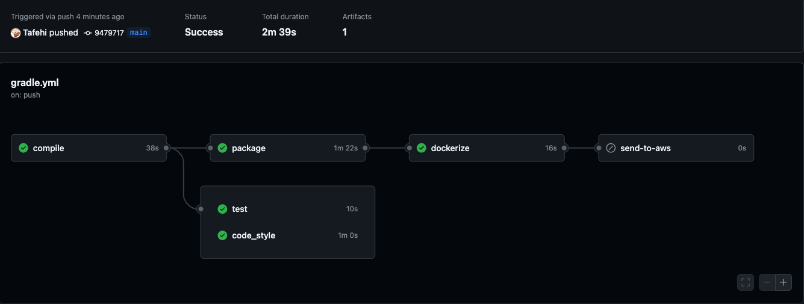

# restapi.mysql

# RESTful API via kotlin
This repo contains code for creating a kotlin application in order to connect to Mysql DB via micronaut.

# How to create the project for Micronaut

to start a project using kotlin and micronaut it is essential to install micronaut on your system.
In order to create a new project two most methods are from web initializer and from cmd.

### Form website:
Go to the `https://micronaut.io/launch/` and by selecting your desire configuration click on generate. Then download a .zip file and open it via your desire code editor such as `
IntelliJ IDEA`

### From terminal:
Install the micronaut on your system, the following cmd is for mac.

``` yaml
brew install micronaut
```
In order to create a project use the following cmd. Remember that you can have your desire name for project.
In below the name is set as `com.mysql.restapi`. To compile the code gradle is also used.

``` yaml
mn create-app --build=gradle_kotlin --jdk=21 --lang=kotlin --test=junit --features=mysql,spring-web,data-jdbc,security-jwt com.mysql.restapi
```
when seeing `| Application created at ~/personal/kotlin/micronautKotlin` is means that the project is created successfully.
# Kotlin Build Pipeline
The following projects has five different stages:
```yaml
stages:
    - compile
    - test
    - code style -> sub task for test stage
    - create docker
    - send to aws
```

Before each step executes set the `GRADLE_USER_HOME` variable to the `.gradle/` folder in the repository.

```yaml
before_script:
  - export GRADLE_USER_HOME=`pwd`/.gradle
```

Cache Gradle files between steps to avoid having to re-download them.

```yaml
cache:
  paths:
    - .gradle/wrapper
    - .gradle/caches
```

### Steps

All steps use the Gradle wrapper (`gradlew`) to run commands, this way Gradle does not need to be installed on the container to run the build process.

**Compile**

The `compile` step runs `gradle assemble` to ensure there are no build errors.

```yaml
compile:
  stage: compile
  script:
    - ./gradlew assemble
```

**Test**

The `test` step uses `gradle test` to run all tests configured in the project. This particular project uses JUnit5 as the test framework.

```yaml
test:
  stage: test
  script:
    - ./gradlew test --stacktrace
```

**Ktlint**

The `code_style` step uses [Ktlint](https://github.com/pinterest/ktlint) to check the code for linting errors.
I have configured Ktlint to generate a report file at `build/ktlint.xml`. This file will get uploaded by Gitlab during the build process and stored for up to 1 day.

I have also configured this step to allow failures. In other words if there are linting errors this step will show a warning, but the rest of the pipeline will continue.

```yaml
code_style:
  stage: test
  script:
    - ./gradlew ktlint
  artifacts:
    paths:
      - build/ktlint.xml
    expire_in: 1 day
  allow_failure: true
```

**Package**

Finally, the `package` step uses the [ShadowJar](https://github.com/johnrengelman/shadow) Gradle plugin to compile a "fat jar" with all the dependencies included.
This file then gets uploaded as an artifact of the build process and stored for 1 day.

```yaml
package:
  stage: package
  script:
    - ./gradlew shadowJar
  artifacts:
    paths:
      - build/libs/*.jar
    expire_in: 1 day
```
**Create Docker**

This stage take the package and create a docker file. This step read the Dockerfile content and create a docker image
base on that. The base image of the docker is `openjdk:21-slim`.
Dockerized application can be found at: `https://gitlab.com/sotware.development/restapi.mysql/container_registry`
which is a local container registry for gitlab. At the last stage `Send to AWS` which sends the docker to the ECR in AWS the
docker image will be pushed from this local container registry to the `ECR AWS`.

**Push To Docker Hub Registry**
When the docker is created at the dockerized step and the image is created via github action,
it will be sent and stored in my personal docker hub account,`https://hub.docker.com/u/tafehi`. This image is stored at ``
Full documentation on how to connect to different registry can be found in `https://github.com/docker/login-action`.


**Send to AWS**

At the last stage the dockerized application will be sent into AWS ECR for being run on any platform.

**CI/CD variables**

To avoid adding credentials to the all credentials for both application to connect to mysql DB and also for AWS are
stored as environmental variables in CI/CD secrets and variables. Please update your required credentials in your CI/CD pipeline.

As shown in ci/cd pipeline status sending the docker file to the aws is a manual step,
meaning that if all stages are successful then the dockerized application will be sent when the play button is clicked.



**API Response via Postman/Insomnia**

When the application is running smoothly, it can be tested via either postman or Insomnia. In below you can see
the final response received from insomnia on `http://localhost:8080/students`


